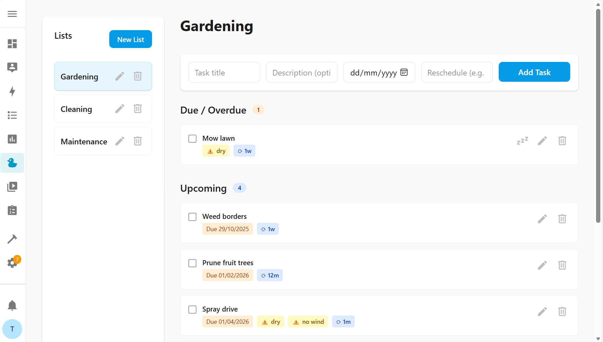

# Home Upkeep

Home Upkeep is a local to-do list for recurring and non-recurring household
tasks, such as cleaning, gardening, and maintenance chores.

It is not a replacement for a calendar and is not intended to alert you if a
task needs doing on a specific day or time (i.e. it is not a bin day
reminder!).

Instead, it is useful for tracking tasks that need doing _when you have
time_. Check what needs doing around the house and garden whenever you have
a free afternoon.

### Recurring tasks

Most task management systems schedule recurring tasks with fixed intervals,
but Home Upkeep understands that life doesn't always follow a strict
schedule. When you complete a task, by default, the next occurrence is
scheduled from that completion date, not the original due date.

**Example:** A cleaning task scheduled every 4 weeks. If you complete it a
week late, the next task will be scheduled 4 weeks from when you actually
finished it, not from the original due date.

For tasks that must maintain a fixed schedule regardless of completion
timing, you can choose to reschedule from the due date instead.

### Seasonal tasks

Gardening and outdoor tasks often have seasonal constraints. Home Upkeep
allows you to specify which months tasks can or cannot be completed in.

**Example:** Pruning fruit trees is an annual task that must be completed
between December and February. Set it up as a yearly recurring task, and if
it slips into February, you'll see a warning telling you it must be done
before March.

Seasonal constraints also apply to recurring tasks. For instance, weed
spraying in the UK typically only happens between April and October. A
monthly spraying task will automatically skip the winter months and resume
in April.

## Screenshot



## Installation

Home Upkeep is a Home Assistant custom integration, installed via
[HACS](https://hacs.xyz/):

1. In HACS, add this repository
   ([`dimac-h/home-upkeep-addon`](https://github.com/dimac-h/home-upkeep-addon))
   as a custom repository of type "Integration".
2. Install "Home Upkeep" from HACS.
3. Restart Home Assistant.
4. Add the integration under **Settings → Devices & services → Add
   Integration → Home Upkeep**.

Once set up, a "Home Upkeep" panel appears in the sidebar, and your task
lists are also available as `todo` entities.

### Migrating from the old add-on

If you were using the previous Home Upkeep **add-on**, migrate your data in
two steps: get it out of the add-on (which needs a browser, not the
filesystem, see rationale below), then import it.

**1. Export your old tasks from the add-on via your browser**

With the app's task list page open and focused, open your browser's DevTools
console (F12, or Cmd+Opt+I on macOS) and paste in the script below. Most
browsers show a warning the first time you paste anything into the
console (something like *"Don't paste code you don't understand"*) and
require you to type `allow pasting` and press Enter before the paste is
accepted. If nothing seems to happen after pasting, that's almost
certainly why; do that, then paste again.

Why? The add-on is only reachable through Home Assistant's ingress proxy, there
is no directly-dialable port, and its data folder
(`/addon_configs/<slug>/data`) is isolated from `/config`, so a typical
File editor/Samba-type add-on can't see it either.

```js
(async () => {
  const res = await fetch("./api/lists");
  if (!res.ok) {
    console.error(
      `Could not fetch lists (HTTP ${res.status}). Make sure this console ` +
        "is open on the Home Upkeep add-on's own tab, not the panel's.",
    );
    return;
  }
  const lists = await res.json();
  console.log(
    `Found ${lists.length} list(s). Copy each JSON block below (between ` +
      "the markers) into its own file, named list_<id>.json.",
  );

  for (const list of lists) {
    const tasks = await (await fetch(`./api/tasks?list_id=${list.id}`)).json();
    const doc = { version: 1, list, tasks };
    console.log(
      `\n----- list_${list.id}.json (${list.name}, ${tasks.length} task(s)) -----`,
    );
    console.log(JSON.stringify(doc, null, 2));
    console.log(`----- end list_${list.id}.json -----`);
  }
})();
```

This prints one JSON block per list with the exact format the add-on itself
writes to disk, so nothing needs converting. It deliberately doesn't try to
trigger a file download: browsers block or silently swallow downloads
that aren't tied to a direct user click, which makes that unreliable from
a pasted console script. Instead, for each list, select the text between
its `-----` markers in the console output, copy it, and save it as
`list_<id>.json` (matching the id in the marker).

**2. Import it into the new integration**

Open the Home Upkeep panel and click the upload icon next to **New List**,
then pick the `list_<id>.json` file(s) you just saved. If a list with the same ID already exists (e.g.
you've already created some lists by hand, or you're re-running the
import), you'll be asked to confirm overwriting it before anything changes;
non-conflicting lists import right away.
